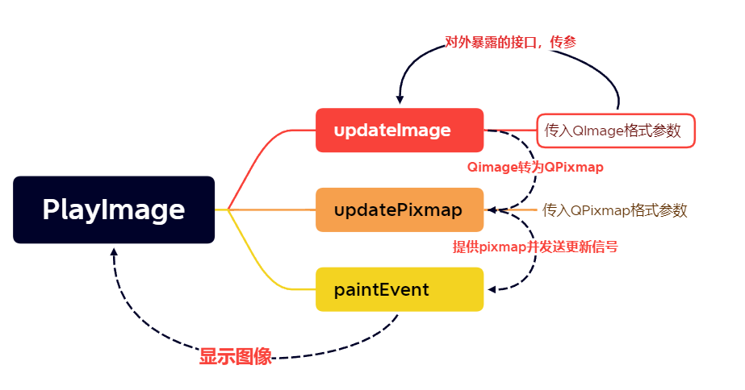
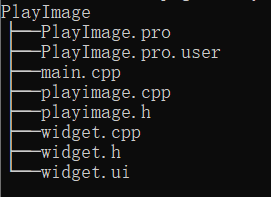

# PlayImage

## 记得一键三连哦

> - 一个使用简单的QPainter绘图事件实现图片播放器的简易demo
> - 支持图片切换
> - 支持多路更新，自己扩展即可
> - 支持幻灯片播放
> - PlayImage自定义控件支持复用，对外提供updateImage和updatePixmap接口，对传入的image和pixmap进行图片更新
> - PlayImage控件支持多线程调用

## 遗留问题

> - 图片分辨率太低
> - 测试次数少，及其简易的学习demo

## 项目代码

> [MyDemo文件夹下的PlayImage](https://github.com/wrk301608/QT-FFMmpeg)

## 项目警告

> - 注：博主本人学习过程的分享，引用他人的文章皆会标注原作者
> - 注：本人文章非盈利性质，若有侵权请联系我删除
> - 注：联系方式Q：2950319782
> - 注：博主本人很菜，文章基本是二次创作，大佬请忽略我的随笔
> - 注：我会一步步分享实现的细节，若仍有问题联系我

## 项目引用

> - [QPainter实现图片更新](https://blog.csdn.net/qq_43627907/article/details/124599535)

## 问题解决

> - [为什么要使用QImage加载图片，使用QPixmap绘制图片](https://www.cnblogs.com/linuxAndMcu/p/16587761.html)

## 开发环境

> - 系统：Win10
> - Qt：5.14.2
> - 编译器：qtcreator  4.11.1， minGW64
> - ffmpeg： 5.12

## 实现功能

> - 支持打开多种格式的图片

## 实现逻辑

> - 

## 项目实现

### 项目结构

> - 

### 项目思路

> - 要制作一款图像显示器的桌面软件，那么要先能把图片文件传入进来
> - 图片文件不可能是单一图像文件，也不可能是单个图片类型的文件，这里我们使用QFileDialog中的getOpenFileNames函数来获取图像文件路径的列表
> - 使用QStringList保存图像文件路径
> - 当加载出来图片的时候，页面默认显示第一张图片，只需要在选择图片的槽函数里，调用PlayImage的updatePixmap函数，把第一张图片的地址传入进去
> - 需要封装一个图片地址转QPixmap的函数
> - 下面来实现切换图片，需要维持一个图片索引值，默认从0开始
> - 先处理向后切换，为方便确定图片的索引，再维持一个图片总数值，再使用取余前后求图片索引值
> - 最后处理幻灯片自动向后播放的功能，再未点击开始播放前，停止播放应该不能被点击，设置一下属性，控制是否播放设置标志为Play，默认为true
> - 要延迟一会发送更新的信号，封装一个阻塞函数sleepMsec