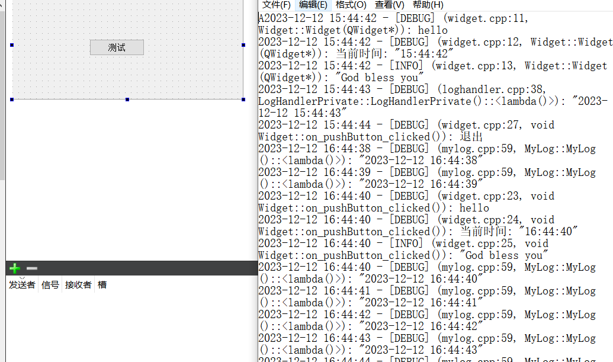
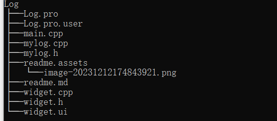
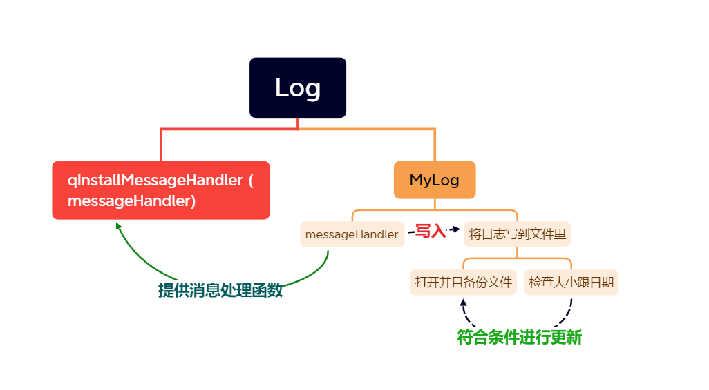

# MyLog

## 说明



> - 使用QT的qInstallMessageHandler函数结合qDebug，qInfo实现自定义的日志系统
> - 输出日志到文件和控制台
> - 自动检测日志文件大小
> - 自动更新日志文件修改日期
> - 自动备份
> - 自动删除一个月前的日志文件
> - 支持多线程程序
> - 支持扩展，可输出日志到数据库，网络，或服务器
> - 支持扩展，可使用config文件进行配置

## 警告

> - 注：博主所有资源永久免费，若有帮助，请点赞转发是对我莫大的帮助
> - 注：博主本人学习过程的分享，引用他人的文章皆会标注原作者
> - 注：本人文章非盈利性质，若有侵权请联系我删除
> - 注：获取资源或者咨询问题请联系Q：2950319782
> - 注：博主本人很菜，文章基本是二次创作，大佬请忽略我的随笔
> - 注：我会一步步分享实现的细节，若仍有问题联系我

## 开发环境

> - win10系统
> - qtcreator4.11.1
> - C++11
> - QT5.14.2

## GitHub

## 问题解决

> - [Qt自定义日志类](https://www.cnblogs.com/linuxAndMcu/p/14716532.html)

## 需求

> - 输出日志信息到日志文件
> - 更新日志的修改日期
> - 日志文件超过一定大小备份老的创建新的
> - 删除一个月前的日志文件

## 结构

> - 
> - 

## 思路

> - 随便创建一个widget程序，放个测试按钮
> - 主要思路是使用 qInstallMessageHandler()接管qDebug(), qWarning()等调试信息，然后将信息流存储至本地日志文件，并管理日志文件
> - 先创建一个MyLog的类，在这里面我们实现自定义的日志系统
> - 这里依然是使用单例实现，整个程序的日志应该只能有一个
> - 首先实现单例getInstance获取MyLog的实例
> - 下面处理MyLog的构造函数，每一次启动日志系统，都要先设置日志文件的路径，然后更新修改日期，然后打开并备份老的日志文件，打开之后，每10分钟刷新日志文件，每1秒都将信息输出到日志，
> - 下面实现这个打开并备份老的日志文件的功能openAndBackupLogFile,这里我们的日志文件以天为单位，先处理一天内多次启动日志系统的情况，以追加的方式写入到日志文件里即可；如果程序运行的时候，日志系统的日期和程序运行日期不统一，同步日志日期为程序运行日期，生成新的日期日志，并且备份老的日志
> - 然后实现处理日志文件过大的问题，只要日志文件超限，备份老的，创建新的即可
> - 然后实现自动删除超时的日志文件，每次启动日志系统的时候，以当前时间为基准，计算出1个月前的时间，遍历日志目录下的所有日志文件，因为日志文件都以时间命名，删除超过1个月的日志文件即可
> - 最后，我们只需要处理信息函数即可，捕获系统中的各种输出信息，输出到文件即可

## 关键代码

### MyLog.h

> ```cpp
> #ifndef MYLOG_H
> #define MYLOG_H
> 
> #include <iostream>
> #include <QDateTime>
> #include <QMutexLocker>
> #include <QDir>
> #include <QTimer>
> #include <QTextStream>
> 
> 
> //最大保存文件大小
> const int g_logLimitSize = 5;
> 
> class MyLog
> {
> public:
>     MyLog();
>     ~MyLog();
> 
>     static MyLog* getInstance();
> 
>     //消息处理函数
>     static void messageHandler(QtMsgType type,
>                                    const QMessageLogContext& context,
>                                    const QString& msg);
> public:
>     //打开并备份之前的日志文件
>     void openAndBackupLogFile();
>     void checkLogFiles();
>     void autoDeleteLog();
>     //安装消息处理函数
>     void installMessageHandler();
> 
>     //卸载消息处理函数，并释放资源
>     void uninstallMessageHandler();
> private:
>     //日志文件夹目录
>     QDir logDir;
>     //重命名日志文件使用的定时器
>     QTimer renameLogFileTimer;
>     //刷新输出到日志文件的定时器
>     QTimer flushLogFileTimer;
>     //日志文件的创建时间
>     QDate logFileCreateDate;
> 
>     //日志文件
>     static QFile* logFile;
>     //输出日志
>     static QTextStream* logOut;
>     //日志锁
>     static QMutex logMutex;
>     static QScopedPointer<MyLog> self;
> };
> 
> #endif // MYLOG_H
> 
> ```
>
> 

### MyLog.cpp

> ```cpp
> #include "mylog.h"
> #include<QDebug>
> #include<QTextCodec>
> 
> #define LOG 1
> //初始化静态变量
> QMutex MyLog::logMutex;
> QFile* MyLog::logFile = NULL;
> QTextStream* MyLog::logOut = NULL;
> QScopedPointer<MyLog> MyLog::self;
> 
> //定义单例模式
> MyLog* MyLog::getInstance()
> {
>     //还没有创建实例
>     if(self.isNull())
>     {
>         //加把锁,只能有一个线程访问
>         static QMutex mutex;
>         //自动加解锁
>         QMutexLocker locker(&mutex);
>         //再次判断有没有实例，防止等待的时间中有线程获取到实例了
>         if(self.isNull())
>         {
>             self.reset(new MyLog);
>         }
>     }
>     return self.data();
> 
> }
> 
> MyLog::MyLog()
> {
>     //设置日志文件夹的路径，./exe
>     logDir.setPath("log");
>     //获取日志的绝对路径
>     QString logPath = logDir.absoluteFilePath("today.log");
> 
>     //获取日志文件创建的时间
>     //保存日志文件最后的修改时间
>     logFileCreateDate = QFileInfo(logPath).lastModified().date();
> 
>     //打开并备份日志文件
>     openAndBackupLogFile();
> 
>     //每10分钟检查一次日志文件创建的时间
>     renameLogFileTimer.setInterval(1000 * 60 *1000);
>     renameLogFileTimer.start();
> 
>     //处理超时事件，10分钟重复一次
>     QObject::connect(&renameLogFileTimer,&QTimer::timeout,[this](){
>         QMutexLocker locker(&MyLog::logMutex);
>         openAndBackupLogFile();
>         checkLogFiles();
>         autoDeleteLog();
>     });
> 
>     //定时刷新日志输出到日志文件，1秒1刷新
>     flushLogFileTimer.setInterval(1000);
>     flushLogFileTimer.start();
> 
>     QObject::connect(&flushLogFileTimer,&QTimer::timeout,[](){
> #if LOG
>         // 测试不停地写入当前时间到日志文件
>         qDebug() << QDateTime::currentDateTime().toString("yyyy-MM-dd hh:mm:ss");
> #endif
>         //刷新
>         QMutexLocker locker(&MyLog::logMutex);
>         if(NULL != logOut)
>         {
>             logOut->flush();
>         }
>     });
> }
> 
> MyLog::~MyLog()
> {
>     if(NULL != logFile)
>     {
>         logFile->flush();
>         logFile->close();
>         logOut = NULL;
>         logFile = NULL;
>     }
> }
> 
> //打开并备份之前的日志文件
> void MyLog::openAndBackupLogFile()
> {
>     //有可能一天多次打开日志文件，使用追加的方式打开
>     //目录不存在，创建目录
>     if(!logDir.exists())
>     {
>         logDir.mkpath(".");
>     }
>     //log.txt的路径
>     QString logPath = logDir.absoluteFilePath("today.log");
> 
>     //程序启动的时候，logfile为空
>     if(logFile == NULL)
>     {
>         //创建新的
>         logFile = new QFile(logPath);
>         //只写，追加的方式打开日志文件
>         //成功，创建文本流对象与日志文件关联，向日志文件写内容
>         logOut = (logFile->open(QIODevice::WriteOnly | QIODevice::Text |QIODevice::Append)) ? new QTextStream(logFile) : NULL;
> 
>         if(logOut != NULL)
>         {
>             //设置编码格式
>             logOut->setCodec("UTF-8");
>         }
> 
>         //日志文件第一次创建，创建日期无效，设置为修改日期
>         if(logFileCreateDate.isNull())
>         {
>             logFileCreateDate = QDate::currentDate();
>         }
>     }
> 
>     //程序运行的时候，创建日期不是当前日期，更新日期，重命名，备份老的并生成新的log.txt
>     if(logFileCreateDate != QDate::currentDate())
>     {
>         //先刷新缓冲区，确保内容先输出到文件里
>         logFile->flush();
>         logFile->close();
> 
>         //更新日期到备份文件
>         QString backUpLogPath = logDir.absoluteFilePath(logFileCreateDate.toString("yyyy-MM-dd.log"));;
>         //备份原来的日志
>         QFile::copy(logPath,backUpLogPath);
>         //删除原来的日志文件
>         QFile::remove(logPath);
> 
>         //创建新的log.txt，进行更新
>         //只写，截断的方式打开日志
>         logFile = new QFile(logPath);
>         logOut = (logFile->open(QIODevice::WriteOnly | QIODevice::Text | QIODevice::Truncate)) ? new QTextStream(logFile) : NULL;
>         //更新为修改时间
>         logFileCreateDate = QDate::currentDate();
>         if(logOut != NULL)
>         {
>             logOut->setCodec("UTF-8");
>         }
>     }
> }
> 
> //检查文件大小
> void MyLog::checkLogFiles()
> {
>     //日志文件大小超过5m，备份并重新创建日志文件
>     if(logFile->size() > 1024* g_logLimitSize)
>     {
>         //清空缓冲
>         logFile->flush();
>         logFile->close();
> 
>         QString logPath = logDir.absoluteFilePath("today.log");
>         //备份老的日志文件
>         QString backUplogPath = logDir.absoluteFilePath(logFileCreateDate.toString("yyyy-MM-dd.log"));
>         QFile::copy(logPath,backUplogPath);
>         QFile::remove(logPath);
> 
>         //创建新的日志文件
>         logFile = new QFile(logPath);
>         logOut = (logFile->open(QIODevice::WriteOnly | QIODevice::Text | QIODevice::Truncate)) ? new QTextStream(logFile) :NULL;
>         logFileCreateDate = QDate::currentDate();
>         if(logOut != NULL)
>         {
>             logOut->setCodec("UTF-8");
>         }
>     }
> }
> 
> //自动删除超过时间的日志文件
> void MyLog::autoDeleteLog()
> {
>     //当前时间
>     QDateTime now = QDateTime::currentDateTime();
> 
>     //基准，30天前
>     QDateTime dateTime1 = now.addDays(-30);
>     QDateTime dateTime2;
> 
>     QString logPath = logDir.absoluteFilePath("today.log");
>     //打开日志目录
>     QDir dir(logPath);
>     //获取目录下的所有文件信息列表
>     QFileInfoList fileList = dir.entryInfoList();
>     foreach(QFileInfo f, fileList)
>     {
>         //跳过文件名为空的文件
>         if(f.baseName() == "")
>         {
>             continue;
>         }
> 
>         //将文件名解析为日期对象
>         dateTime2 = QDateTime::fromString(f.baseName(),"yyyy-MM-dd");
>         //大于30天，删除
>         if(dateTime2 < dateTime1)
>         {
>             dir.remove(f.absoluteFilePath());
>         }
>     }
> }
> 
> 
> //定义消息处理函数
> void MyLog::messageHandler(QtMsgType type, const QMessageLogContext &context, const QString &msg)
> {
>     QMutexLocker locker(&MyLog::logMutex);
>         QString level;
> 
>         switch (type) {
>         case QtDebugMsg:
>             level = "DEBUG";
>             break;
>         case QtInfoMsg:
>             level = "INFO";
>             break;
>         case QtWarningMsg:
>             level = "WARN";
>             break;
>         case QtCriticalMsg:
>             level = "ERROR";
>             break;
>         case QtFatalMsg:
>             level = "FATAL";
>             break;
>         default:
>             break;
>         }
> 
> #if defined (Q_OS_WIN)
>         QByteArray localMsg = QTextCodec::codecForName("GB2312")->fromUnicode(msg);
> #else
>         QByteArray localMsg = msg.toLocal8Bit();
> #endif
> 
>         //输出到控制台
>         std::cout << std::string(localMsg) << std::endl;
>         if(NULL == MyLog::logOut)
>         {
>             return;
>         }
> 
>         //输出到日志文件
>         //获取文件名，去掉路径
>         QString fileName = context.file;
>         int index = fileName.lastIndexOf(QDir::separator());
>         fileName = fileName.mid(index + 1);
> 
>         //写入日志信息
>         (*MyLog::logOut) << QString("%1 - [%2] (%3:%4, %5): %6\n")
>                                         .arg(QDateTime::currentDateTime().toString("yyyy-MM-dd hh:mm:ss"))
>                                         .arg(level)
>                                         .arg(fileName)
>                                         .arg(context.line)
>                                         .arg(context.function)
>                                         .arg(msg);
> }
> 
> //安装
> void MyLog::installMessageHandler()
> {
>     qInstallMessageHandler(MyLog::messageHandler);
> }
> 
> //卸载
> void MyLog::uninstallMessageHandler()
> {
>     qInstallMessageHandler(NULL);
> }
> 
> ```
>
> 