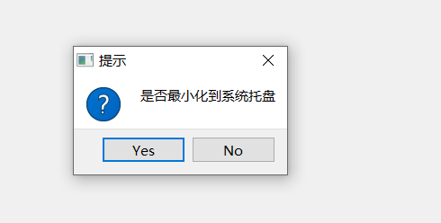
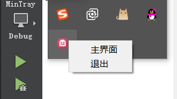
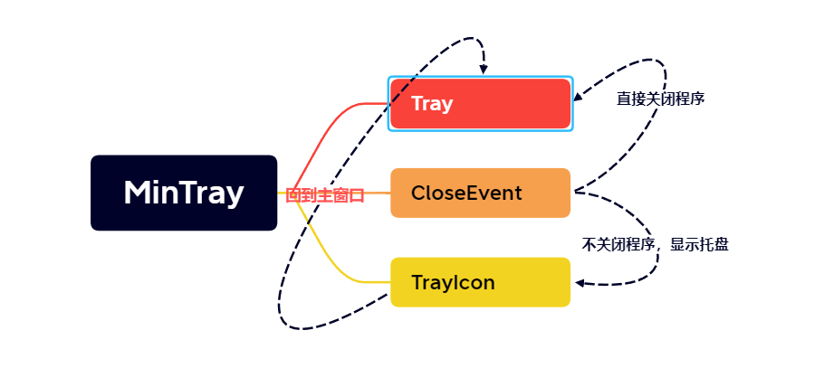
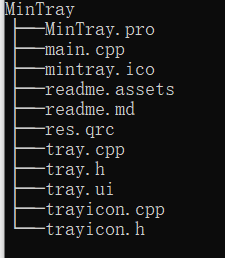

# MinTray

## 说明

> - 
> - 
> - 实现程序关闭时最小化托盘的功能
> - 托盘实现显示主页面和退出的功能
> - 支持扩展，直接引用TrayIcon类即可，对外暴露接口
> - 单例实现，可复用

## 警告

> - 注：博主所有资源永久免费，若有帮助，请点赞转发是对我莫大的帮助
> - 注：博主本人学习过程的分享，引用他人的文章皆会标注原作者
> - 注：本人文章非盈利性质，若有侵权请联系我删除
> - 注：获取资源或者咨询问题请联系Q：2950319782
> - 注：博主本人很菜，文章基本是二次创作，大佬请忽略我的随笔
> - 注：我会一步步分享实现的细节，若仍有问题联系我

## GitHub

> [QtDemo下的Mintray](https://github.com/wrk301608/QT-FFmpeg)

## 开发环境

> - win10系统
> - qtcreator4.11.1
> - QT版本：5.14.2

## 问题解决

> - [单例模式](https://subingwen.cn/design-patterns/singleton/)
> - [QSystemTrayIcon](https://blog.csdn.net/liang19890820/article/details/52014110)

## 需求

> - 程序在关闭的时候需要供用户选择是直接关闭程序还是最小化在托盘运行
> - 在托盘运行，程序主界面要隐藏
> - 托盘要提供最基本的显示回主界面和退出程序的功能

## 结构

> - 
> - 

## 思路

> - 这里主要为了实现关闭程序的时候实现程序托盘运行的demo，随便创建一个widget程序Tray即可，重写窗口的CloseEvent事件，处理关闭程序和最小化到托盘运行的功能
> - 使用QT自带的QSystemTrayIcon来实现托盘的功能，单独创建一个TrayIcon类来封装，继承自Object即可，不需要ui文件，
> - 由于托盘这个类功能比较单一，而且是需要的 时候才创建，而且不能跟随调用者的生存周期，这里使用懒汉单例实现最好，最好使用智能指针，省的发生内存泄漏，在Tray窗口需要的时候才创建
> - 下面先来实现TrayIcon的单例，这里使用返回static TrayIcon* 的Instance函数加独占智能指针实现
> - 这里我是选择在CloseEvent事件中创建TrayIcon实例
> - 在TrayIcon类中，首先需要维持所属的主窗体mainWidget和托盘对象trayIcon，同时定义public的设置主窗体函数setMainWidget来设置调用的主窗体
> - 在TrayIcon的构造函数中实例化托盘对象trayIcon，设置图标，完成初始配置
> - 到这里只要设置托盘为可见，托盘就已经可以显示出来了，但是没法关闭程序和显示主页面了，下面来实现这两个功能
> - 首先创建菜单QMenu，因为这个菜单功能主要是跟主窗口的交互，那么在传入主窗口的setMainWidget函数中设置菜单为好
> - 先加上回显主窗体的功能，定义回显函数showMainWidget
> - 下面处理关闭程序的功能，这里最好是设置一个是关闭托盘还是关闭程序的标志位，判断一下最好
> - 菜单功能处理后，是需要将菜单和鼠标右键绑定，否则不能处理相关操作
> - 最后处理一下托盘激活程序，为了简单，这里双击和单击都回显主窗体

## 关键代码

> - 重写CloseEvent事件
>
>   ```cpp
>   void Tray::closeEvent(QCloseEvent *event)
>   {
>       //弹出一个选择按钮，是否最小化程序到托盘运行
>       QMessageBox::StandardButton button = QMessageBox::question(this,"提示","是否最小化到系统托盘", QMessageBox::Yes|QMessageBox::No,
>   QMessageBox::Yes);
>       //不关闭程序，最小化程序到托盘运行
>       if(button == QMessageBox::Yes)
>       {
>           //设置托盘所属的主窗体
>           TrayIcon::Instance()->setMainWidget(this);
>           //忽略关闭事件
>           event->ignore();
>           //隐藏主窗口
>           this->hide();
>           //设置托盘可见
>           TrayIcon::Instance()->setVisible(true);
>           //设置提示消息，看不见消息的是电脑开启了勿扰模式
>           TrayIcon::Instance()->showMessage("自定义最小化托盘",
>                                             "已最小化");
>       }
>       //关闭程序
>       else
>       {
>           event->accept();
>       }
>   }
>   
>   ```
>
> - 实现懒汉单例
>
>   ```cpp
>   //定义懒汉单例
>   TrayIcon* TrayIcon::Instance()
>   {
>       if(self.isNull())
>       {
>           static QMutex mutex;
>           QMutexLocker locker(&mutex);
>           if(self.isNull())
>           {
>               self.reset(new TrayIcon);
>           }
>       }
>       return self.data();
>   }
>   ```
>
> - 回显主窗体函数
>
>   ```cpp
>   //定义显示主界面的槽函数
>   void TrayIcon::showMainWidget()
>   {
>       //有主窗体
>       if(mainWidget)
>       {
>           //显示出来主窗体
>           mainWidget->showNormal();
>           //重新聚焦主窗体
>           mainWidget->activateWindow();
>       }
>   }
>   ```
>
> - 关闭程序函数
>
>   ```cpp
>   //定义关闭的槽函数
>   void TrayIcon::closeAll()
>   {
>       //隐藏，并删掉，退出程序
>       trayIcon->hide();
>       trayIcon->deleteLater();
>       qApp->exit();
>   }
>   ```
>
> - 设置调用的主窗体，并绑定相关的功能
>
>   ```cpp
>   //定义设置所属的主窗体
>   void TrayIcon::setMainWidget(QWidget *mainWidget)
>   {
>       this->mainWidget = mainWidget;
>       //给托盘加上菜单功能
>       menu->addAction("主界面",this,SLOT(showMainWidget()));
>       //直接退出
>       if(exitDirect)
>       {
>           menu->addAction("退出",this,SLOT(closeAll()));
>       }
>       else
>       {
>           menu->addAction("退出",this,SIGNAL(trayIconExit()));
>       }
>       //菜单绑定到右键
>       trayIcon->setContextMenu(menu);
>   
>   }
>   ```
>
>   