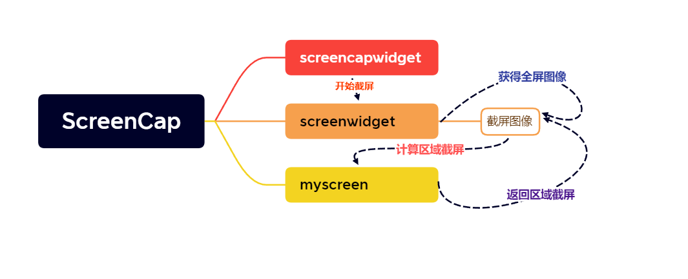

# ScreenCap

## 说明

> - 
> - 
> - 支持全屏截图
> - 支持鼠标拖动截图
> - 支持拖拽截图
> - 支持设置默认保存地址
> - 支持另存为
> - 支持热键绑定，快速截图
> - 支持托盘功能，实现最小化运行
> - 使用单例模式
> - 使用智能指针
> - 多线程编程

## ToDo

> - 兼容linux系统
> - 截完图直接打上水印

## 警告

> - 注：博主所有资源永久免费，若有帮助，请点赞转发是对我莫大的帮助
> - 注：博主本人学习过程的分享，引用他人的文章皆会标注原作者
> - 注：本人文章非盈利性质，若有侵权请联系我删除
> - 注：获取资源或者咨询问题请联系Q：2950319782
> - 注：博主本人很菜，文章基本是二次创作，大佬请忽略我的随笔
> - 注：我会一步步分享实现的细节，若仍有问题联系我

## GitHub

## 问题解决

> - QScopedPointer
> - QRect
> - QSize
> - showEvent
> - QApplication
> - QScreen
> - grabWindow函数

## 需求

> - 提供设置页面，提供开始截图和热键绑定和默认地址的功能
> - 截图部分提供右键菜单选择，实现保存当前的截图，保存全屏截图，截图另存为，全屏截图另存为，退出截图的功能
> - 处理鼠标事件，实现选择截屏和拖拽截屏
> - 处理默认保存图片的位置
> - 处理键盘热键的功能，提供快捷键截屏
> - 处理最小化托盘运行的需求

## 结构

> - 主要逻辑

## 思路

### screencapwidget

> - 首先需要创建页面ScreenCapWidget，提供开始截屏，按键设置，默认位置的按钮
> - 首先实现开始截屏的功能，这里不能直接在窗口线程实现，需要单独创建一个screenwidget类实现截屏的主要操作
> - 获取到screenwidget的实例后，应该处理截屏的逻辑了，创建实例的时候直接调用screenwidget父类widget的showFullScreen函数，将screenwidget以全屏的方式显示出来，整个屏幕是当前截屏的操作区域，遮挡其他操作，这里我们重写一下screenwidget的showEvent事件

### screenwidget

> - 而这个screenwidget类不应该一直存在，应该是调用开始截屏的时候才开始创建，这里为了保证同一时刻只有一个screenwidget类创建，应该使用单例模式，确保只有一个实例
> - screenwidget创建的时候不需要ui文件，这里我们只需要使用widget里的绘图事件和菜单功能，自己使用代码实现
> - 在头文件里首先维持一个静态的QScopedPointer对象self，用于实现单例模式
> - 定义一个公共的静态接口Instance以实现其他类来生成screenwidget对象
> - 下面来实现类的默认构造函数，提供菜单功能，实现保存当前的截图，保存全屏截图，截图另存为，全屏截图另存为，退出截图的功能
> - 因为screencapwidget调用其fullShowScreen函数，这里重写showEvent函数
> - showEvent函数中，直接获取当前主屏幕的全屏图像保存在fullScreen中，为提示用户截屏开始了，这里获取到全屏对象后，模糊处理全屏，维持一个背景值bgScreen实现背景处理
> - 截屏界面的交互逻辑等会再实现，先处理关键的部分，创建一个myscreen类，实现截屏实现的数据主要逻辑
> - 重写完showEvent后，已经获取到全屏图像了，需要开始处理部分截图了，即处理鼠标事件，首先处理鼠标按下press事件，第一次按下的位置就是起始位置，再根据此时myscreen的STATUS处理对应的事件
> - 处理鼠标移动的事件，如果还在myscreen还在选择状态，那么移动完的位置就是截屏的结束位置，myscreen在移动状态，那么计算偏移量减去移动开始时候的起始位置movPos即可，将偏移量传入myscreen的move函数中，计算move后的截屏区域
> - 主要的鼠标事件处理完了，下面处理release和右键事件
> - 鼠标事件处理完了之后，要截屏的图像的区域我们已经知道了，下面重写paint事件

### myscreen

> - 该类主要实现对截屏的数据计算，来给screenwidget重写事件提供详细的数据
> - 这里的类不需要窗口文件，创建纯粹的cpp类即可
> - 需要获得从screenwidget类传入的qsize参数，这里使用带qsize参数的构造函数
> - 首先截屏需要维护屏幕长和宽的值，maxHeight和maxWidth，这里的数据应该是谁调用谁能获取，全部设置为私有属性，还需要设置其getWidth和getHeight方法
> - 还需要维持截屏区域的左上角和右下角的point值leftUpPos和rightDownPos，并设置getLeftUp和getRightDown方法
> - 处理鼠标事件的时候，需要判断当前截图的状态，维持枚举值STATUS，保存选择截屏区域，拖拽截屏，
> - 这里需要实现判断鼠标是否在现有的截屏区域内isInArea和计算移动后的截屏位置的move函数

### 其他功能

#### 默认位置

> - 这里为了方便保存默认的截图位置

## 关键代码

> **注：关键代码只负责解释各部分的逻辑关系，详解看代码注释**
>
> - screencapwidget处理开始截屏的功能，创建screenwidget的唯一实例，并显示全屏窗口
>
>   ```cpp
>   //ScreenWidget全屏显示
>       ScreenWidget::Instance()->showFullScreen();
>   ```
>
> - 与showFullScreen相关的screenwidget的重写showEvent事件
>
>   ```cpp
>   //重写窗口被显示的事件
>   void ScreenWidget::showEvent(QShowEvent *)
>   {
>       //设置初始位置
>       QPoint point(-1,-1);
>       myscreen->setStart(point);
>       myscreen->setEnd(point);
>       
>       //获取当前屏幕对象
>       QScreen* pscreen = QApplication::primaryScreen();
>       //调用QScreen的grabwindow进行全屏截图
>       *fullScreen = pscreen->grabWindow(0,0,0,myscreen->getWidth(),myscreen->getHeight());
>       
>       //设置透明度实现模糊背景
>       QPixmap pix(myscreen->getWidth(),myscreen->getHeight());
>       pix.fill((QColor(160,160,160,200)));
>       bgScreen = new QPixmap(*fullScreen);
>       QPainter p(bgScreen);
>       p.drawPixmap(0,0,pix);
>   }
>   ```
>
> 
>
> - screenwidget实现单例模式的主要代码
>
> - ```cpp
>   //定义单例模式，确保截屏的时候只能有一个
>   ScreenWidget* ScreenWidget::Instance()
>   {
>       //还没有创建实例
>       if(self.isNull())
>       {
>           //加把锁,只能有一个线程访问
>           static QMutex mutex;
>           //自动加解锁
>           QMutexLocker locker(&mutex);
>           //再次判断有没有实例，防止等待的时间中有线程获取到实例了
>           if(self.isNull())
>           {
>               self.reset(new ScreenWidget);
>           }
>       }
>       return self.data();
>       
>   }
>       
>   ```
>
> - screenwidget提供的菜单功能
>
> - ```cpp
>   //创建一个菜单文件
>       menu = new QMenu(this);
>       //添加菜单的功能
>       menu->addAction("保存当前的截图",this,SLOT(saveScreen()));
>       menu->addAction("保存全屏截图",this,SLOT(saveFullScreen()));
>       menu->addAction("截图另存为",this,SLOT(saveScreenOther()));
>       menu->addAction("全屏截图另存为",this,SLOT(saveFullOther()));
>       menu->addAction("退出截图",this,SLOT(hide()));
>   ```
>
> - screenwidget维持myscreen的类，并在screenwidget的构造函数中实例化myscreen类，传入当前屏幕的大小，二者同步生成
>
>   ```cpp
>   myScreen* myscreen;
>   ```
>
>   ```cpp
>    //获取屏幕大小
>       myscreen = new myScreen(deskGeometry.size());
>   ```
>
> - 获取到当前屏幕的qrect对象，调用size函数获取屏幕的size值，使用宏展开式，不单独处理了，需要的时候直接绽开计算
>
>   ```cpp
>   #define deskGeometry qApp->primaryScreen()->geometry()
>   ```
>
> - 处理图片移动
>
>   ```cpp
>   void myScreen::move(QPoint p)
>   {
>       //计算move后的四个点坐标
>       int lx = leftUpPos.x() + p.x();
>       int ly = leftUpPos.y() + p.y();
>       int rx = rightDownPos.x() + p.x();
>       int ry = rightDownPos.y() + p.y();
>       //确保移动后的截屏不会超出屏幕范围
>       if(lx < 0)
>       {
>           lx = 0;
>           rx -= p.x();
>       }
>       if(ly < 0)
>       {
>           ly = 0;
>           ry -= p.y();
>       }
>       if(rx > maxWidth)
>       {
>           rx = maxWidth;
>           lx -= p.x();
>       }
>       if(ry > maxHeight)
>       {
>           ry = maxHeight;
>           ly -= p.y();
>       }
>   
>       //更新移动后的值
>       leftUpPos = QPoint(lx,ly);
>       rightDownPos = QPoint(rx,ry);
>       startPos = leftUpPos;
>       endPos = rightDownPos;
>   }
>   ```
>
> - 处理鼠标press
>
>   ```cpp
>   void ScreenWidget::mousePressEvent(QMouseEvent *e)
>   {
>       int status = myscreen->getStatus();
>       //选择区域的状态
>       if(status == myScreen::SELECT)
>       {
>           //把鼠标按下的位置设置为开始位置
>           myscreen->setStart(e->pos());
>       }
>       //拖拽截屏
>       else if(status == myScreen::MOV)
>       {
>           //鼠标不在截屏的区域内，是要重新选择截屏区域
>           if(myscreen->isInArea(e->pos()) == false)
>           {
>               //新按下的位置设置为开始位置，并重置状态为选择
>               myscreen->setStart(e->pos());
>               myscreen->setStatus(myScreen::SELECT);
>           }
>           //在截屏区域内，是要拖拽截屏
>           else
>           {
>               //开始移动的起始位置就是现在鼠标按下的位置
>               movPos = e->pos();
>               this->setCursor(Qt::SizeAllCursor);
>           }
>       }
>       this->update();
>   }
>   ```
>
> - 处理鼠标move
>
>   ```cpp
>   void ScreenWidget::mouseMoveEvent(QMouseEvent *e)
>   {
>       //在选择状态
>       if(myscreen->getStatus() == myScreen::SELECT)
>       {
>           myscreen->setEnd(e->pos());
>       }
>       //在移动状态
>       else if(myscreen->getStatus() == myScreen::MOV)
>       {
>           //计算鼠标偏移量
>           QPoint p(e->x() - movPos.x(),e->y() - movPos.y());
>           myscreen->move(p);
>           movPos = e->pos();//保存上一次鼠标的位置
>       }
>       //触发窗口的更新,重新绘制屏幕截图和矩形框
>       this->update();
>   }
>   ```
>
>   