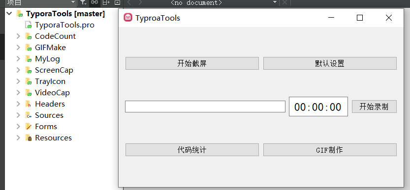
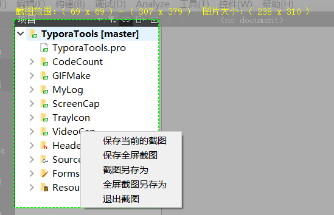
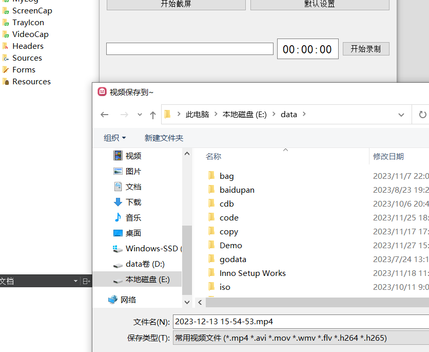
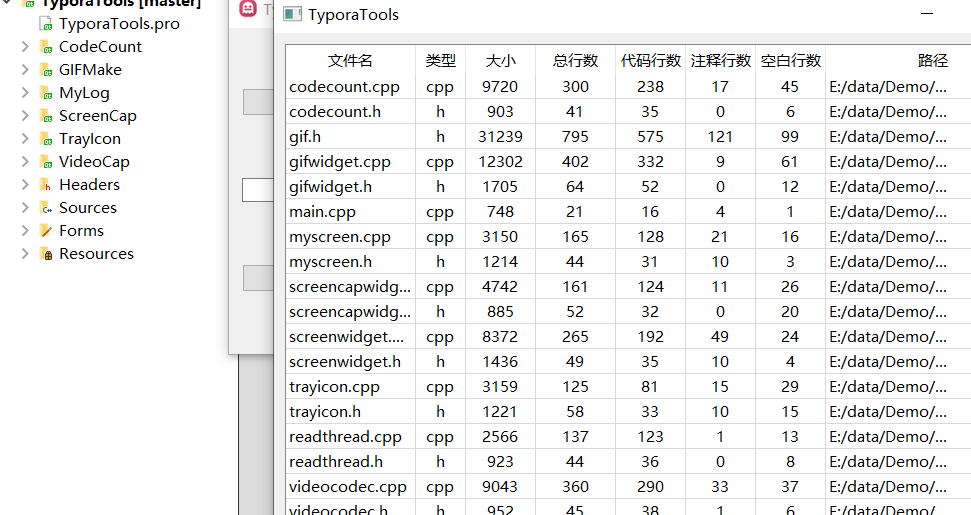
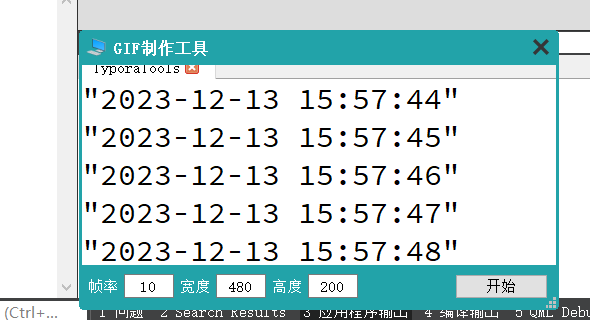
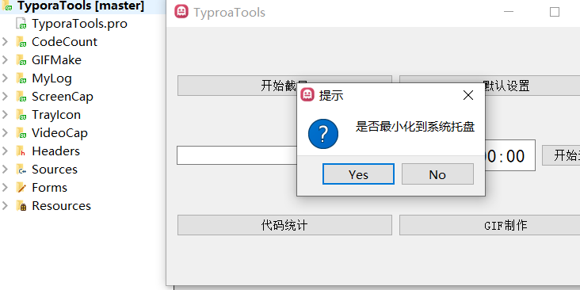
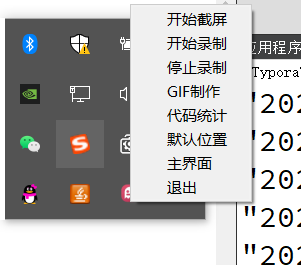
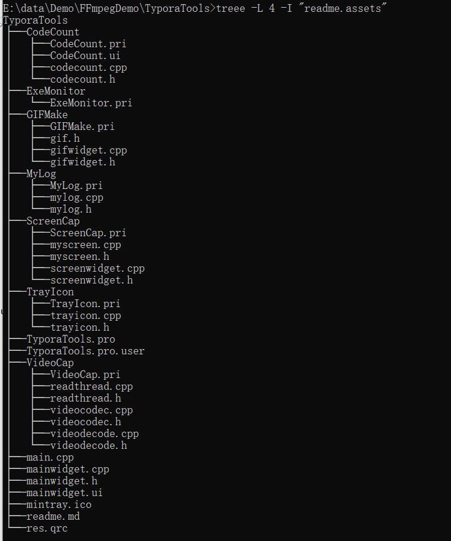

# TyporaTools----Develop Version 001

## 项目总述

> - 本人喜欢使用Typora编写文档和博客，奈何Typora只对文本支持比较好
> - 出于学习目的，结合本人现有技能，开发的第一版本的TyporaTools
> - TyporaTools：一款服务于Typora的资源处理工具

## 说明

> - 程序主界面
> - 支持全屏截图和区域截图
> - 
> - 支持设置默认文件资源的保存位置
> - 
> - 支持对桌面进行录制，保存视频文件到本地
> - 
> - 支持统计代码文件和项目文件实现代码统计
> - 
> - 支持GIF制作，支持自拖拽大小
> - 
> - 支持最小化到托盘运行
> - 
> - 实现托盘菜单功能
> - 
> - 实现简易日志系统
> - 

## ToDo

> - 第一版本，博主实现的累了，过几天再完善文档
> - GIF功能实现有抖动，进行改进
> - 实现录制麦克风的声音
> - 升级日志系统
> - 完善托盘功能
> - 添加config设置选项
> - 程序打包发布
> - 进行多系统适配

## 开发环境

> - 平台：windows10系统
> - 编译器：qtcreator 4.11.1
> - QT版本： 5.14.2
> - FFmpeg版本： 5.1.2
> - 开发语言：C++ 11

## 警告

> - 注：博主所有资源永久免费，若有帮助，请点赞转发是对我莫大的帮助
> - 注：博主本人学习过程的分享，引用他人的文章皆会标注原作者
> - 注：本人文章非盈利性质，若有侵权请联系我删除
> - 注：获取资源或者咨询问题请联系Q：2950319782
> - 注：博主本人很菜，文章基本是二次创作，大佬请忽略我的随笔
> - 注：我会一步步分享实现的细节，若仍有问题联系我
> - 注：博主博客： [博客园](https://www.cnblogs.com/kanhai1024/)    [CSDN](https://i.csdn.net/#/user-center/profile?spm=1000.2115.3001.5111)

## GitHub

## 问题解决

> - [C++和QT实现日志系统系统](https://www.cnblogs.com/kanhai1024/p/17897560.html)
> - [截图功能实现](https://www.cnblogs.com/kanhai1024/p/17883714.html)
> - [托盘功能的实现](https://www.cnblogs.com/kanhai1024/p/17880423.html)

## 需求

## 结构

> - 

## 思路

## 关键代码